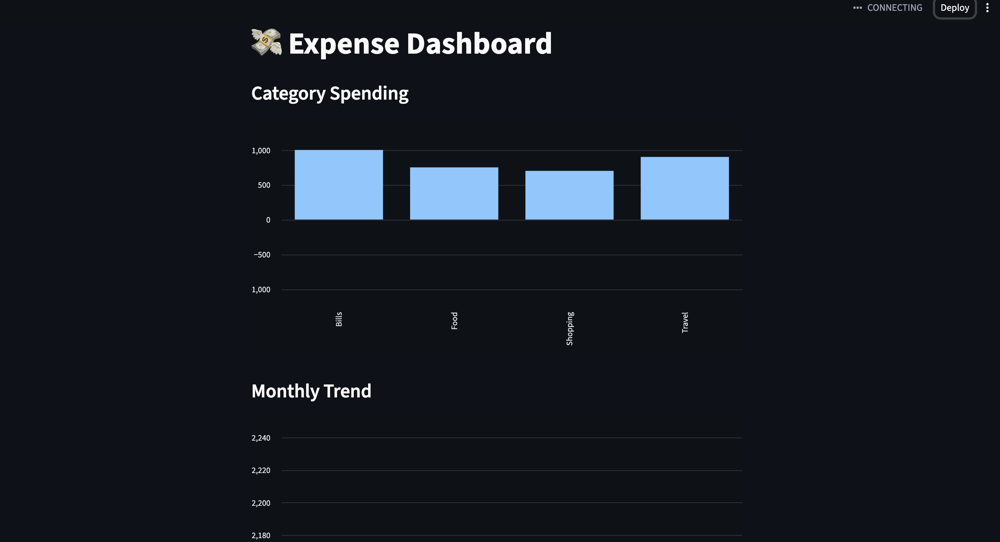
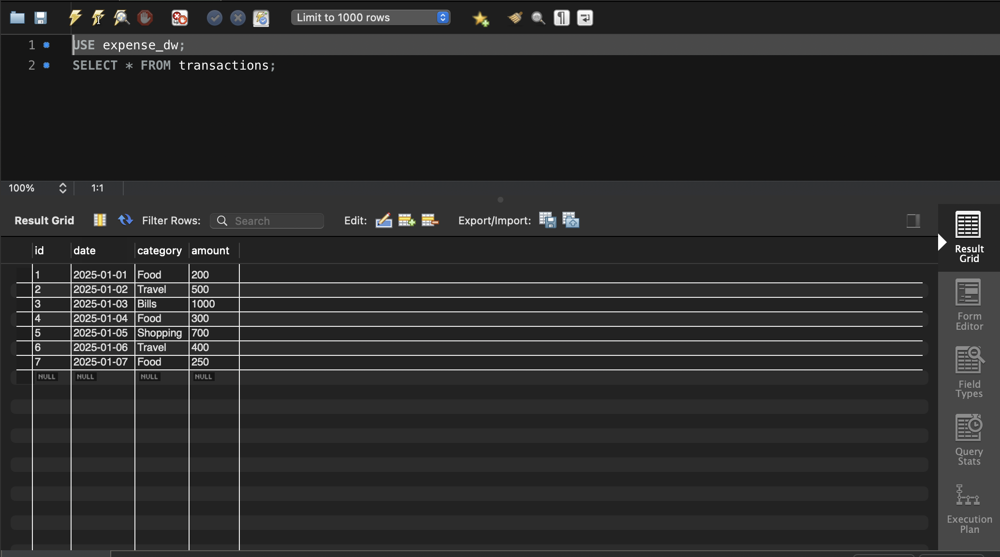
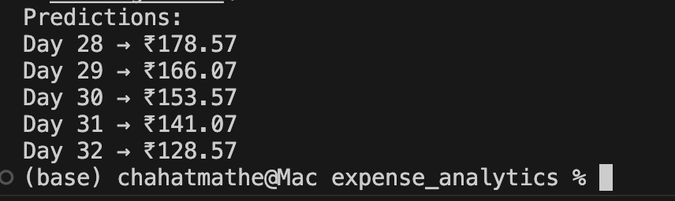

# 📊 Data Warehouse Analytics System

## 🚀 Overview
This project is an end-to-end data analytics system that processes raw financial data, stores it in a structured data warehouse, and generates insights using visualization and machine learning.

## 🧱 Architecture
CSV Data → Python ETL → MySQL → Analysis → Dashboard → ML Prediction

## 🛠️ Tech Stack
- Python (Pandas, NumPy, Scikit-learn)
- MySQL
- Streamlit
- Matplotlib

## 📊 Features
- ETL pipeline for data cleaning and transformation
- Data storage using MySQL
- Data analysis using SQL and Pandas
- Interactive dashboard using Streamlit
- Expense prediction using Linear Regression

## ▶️ How to Run
```bash
pip install -r requirements.txt
python etl.py
streamlit run app.py

## 📸 Project Output

Below are sample outputs demonstrating data processing, visualization, and prediction capabilities of the system.
## 📈 Dashboard


## 🗄️ Database


## 🤖 ML Predictions

